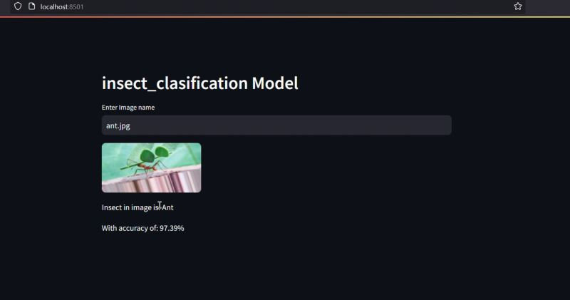

<div align="center">

# 🐜 Insect Classification Project

### Deep Learning Based Insect Species Classification using Convolutional Neural Networks (CNN)

An AI-powered web application that classifies insect species from images using a trained **Convolutional Neural Network (CNN)** model built with Python.


---

### 🧠 Deep Learning • Computer Vision • Image Classification • CNN

</div>

---

# 📖 About

The **Insect Classification Project** is a Deep Learning application that identifies insect species from images using a **Convolutional Neural Network (CNN)**.

The model was trained on an insect image dataset and achieved an overall **90% classification accuracy**, making it capable of accurately recognizing different insect species from unseen images.

Users simply enter or upload an insect image through the web interface, and the trained CNN predicts the insect species along with the prediction confidence.

---

# ✨ Features

- 🐜 Insect Species Classification
- 🧠 CNN-Based Deep Learning Model
- 🎯 Model Trained with **90% Accuracy**
- 📷 Image Prediction
- 📊 Confidence Score Display
- ⚡ Fast Image Classification
- 🌐 Simple and User-Friendly Interface
- 💻 Developed in Python

---

# 📈 Model Performance

| Metric | Value |
|--------|-------|
| Model | Convolutional Neural Network (CNN) |
| Training Accuracy | **90%** |
| Task | Multi-Class Insect Classification |
| Framework | TensorFlow / Keras |
| Programming Language | Python |

> The CNN model achieved approximately **90% classification accuracy**, demonstrating its effectiveness in identifying insect species from images.

---

# 🖼️ Screenshot

## Application Interface



---

# 🛠️ Tech Stack

## Programming Language

- Python

## Deep Learning

- TensorFlow
- Keras
- Convolutional Neural Network (CNN)

## Image Processing

- OpenCV
- NumPy

## Web Framework

- Streamlit

## Visualization

- Matplotlib

---

# 🧠 CNN Architecture

```
                Input Image
                     │
                     ▼
           Image Preprocessing
                     │
                     ▼
           Resize & Normalize
                     │
                     ▼
      Convolution + ReLU Layer
                     │
                     ▼
             Max Pooling Layer
                     │
                     ▼
      Convolution + ReLU Layer
                     │
                     ▼
             Max Pooling Layer
                     │
                     ▼
                Flatten Layer
                     │
                     ▼
             Fully Connected
                     │
                     ▼
               Softmax Output
                     │
                     ▼
         Predicted Insect Species
```

---

# 📂 Project Structure

```
Insect-classification-project
│
├── assets/
│   └── home.png
│
├── dataset/
├── model/
├── app.py
├── requirements.txt
├── train_model.py
├── README.md
└── ...
```

---

# 🚀 Installation

## Clone Repository

```bash
git clone https://github.com/bjnepali7/Insect-classification-project.git
```

Go into the project folder

```bash
cd Insect-classification-project
```

---

## Create Virtual Environment

```bash
python -m venv venv
```

### Activate Virtual Environment

### Windows

```bash
venv\Scripts\activate
```

### Linux / macOS

```bash
source venv/bin/activate
```

---

## Install Dependencies

```bash
pip install -r requirements.txt
```

---

## Run the Application

```bash
streamlit run app.py
```

The application will start at:

```
http://localhost:8501
```

---

# 🔄 Workflow

```
User Inputs Image
         │
         ▼
Image Preprocessing
         │
         ▼
Resize & Normalize
         │
         ▼
CNN Model Prediction
         │
         ▼
Confidence Calculation
         │
         ▼
Display Predicted Insect
```

---

# 📊 Example Prediction

| Input Image | Prediction | Confidence |
|-------------|------------|-----------:|
| 🐜 Ant | Ant | **97.39%** |

---

# 🎯 Future Improvements

- 🦋 Support More Insect Species
- 📱 Mobile Application
- 🌐 Deploy on Cloud
- 🎥 Real-Time Camera Detection
- 📷 Upload Images Directly
- 🤖 Transfer Learning (ResNet, EfficientNet)
- 📊 Model Performance Dashboard

---

# 🤝 Contributing

Contributions are welcome!

1. Fork this repository.

2. Create your feature branch

```bash
git checkout -b feature-name
```

3. Commit your changes

```bash
git commit -m "Added new feature"
```

4. Push to GitHub

```bash
git push origin feature-name
```

5. Open a Pull Request.

---

# ⭐ Support

If you found this project useful, please consider giving it a **⭐ Star** on GitHub.

---

# 👨‍💻 Author

**Bijay Nepali**

🐙 GitHub: https://github.com/bjnepali7

---

<div align="center">

## 🐜 Smart Insect Identification Powered by Deep Learning

**Built with ❤️ using Python, TensorFlow, CNN, and Streamlit**

</div>
